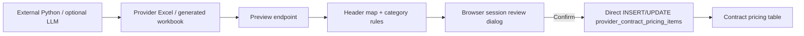
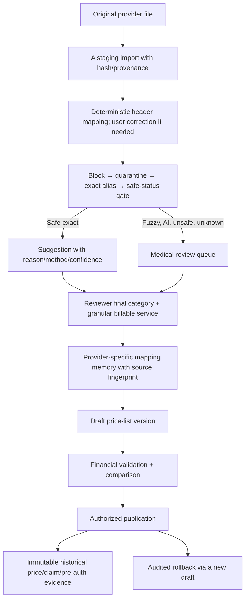

# Medical-review workflow comparison: System A vs System B

**Assessment date:** 2026-07-13  
**Method:** read-only source and workflow review. No repository was modified, merged, imported, migrated, committed, or pushed. No external AI call was executed. All data described in the brief is synthetic/test data.  
**System A:** local `D:\waad_sofyan_final`, branch `main`, HEAD `061e0619e4a543b87166da28b7008f2003b5ae33` (`feat(backup): add manual backup and server-side storage model`).  
**System B:** public GitHub [`OmarAfoshAhmad/waad_sofyan_final`](https://github.com/OmarAfoshAhmad/waad_sofyan_final), default branch `main`, inspected HEAD `0dae41ea9083f7bf4039d49ced10756963c44436` (`fix all error`, 2026-07-13T11:55:53Z).

## 1. Executive verdict

**Decision: C — keep System A as the operational core and selectively adopt System B components after rewrite.**

Waad should adopt **System A's governed in-system workflow** for medical review, provider contracts and provider-price-list publication:

- raw-file/staging preservation;
- review queues and reviewer decisions;
- financial validation;
- draft/approval/publication/rollback price-list versions;
- audit and claim/pre-authorization history protection.

System B is useful as a source of **practical Excel header aliases, deterministic category heuristics and provider-specific rule ideas**, but not as the production workflow. Its Python scripts are external preprocessing; its AI script is a broad-category classifier with fallback-to-valid-looking output; and its integrated preview/confirm process writes price rows directly into live contract pricing. It has no evidence of the current System A-style staging/version/audit lifecycle.

System B is best classified as **D — a mixture of integrated import UI/rules and experimental/external Excel processing**, not a fully integrated alternative.

## 2. What System A actually implements

### Integrated architecture

System A runs Spring Boot/PostgreSQL in Docker locally and has a dedicated `medicalclassification` module. Flyway V70–V75 and the current local DB provide these integrated records:

- `price_list_imports` — provider/contract, original file provenance/hash/path, engine configuration, counters, status and error data;
- `price_list_import_lines` — raw provider name/code/price/category, normalized name, match/suggestion/final IDs, confidence, method, flags, review decision and timestamps;
- `provider_price_list_versions` — per-contract `DRAFT/ACTIVE/SUPERSEDED/ARCHIVED` versions;
- `price_list_validation_findings` and price-change audit — financial validation and audit evidence;
- `ent_service_aliases`, `catalog_classification_history` and reviewer decisions — reusable knowledge loop;
- existing `provider_contract_pricing_items`, `medical_services`, `medical_categories`, claims and pre-authorization fields — operational billing and history.

The local DB contains 18 classification imports, 6,316 staged import lines, 5 price-list versions (one active), and no tested orphan references in the relevant joins. It also preserves provider raw service code/name/price separately from catalog and claim-line fields.

### Actual end-to-end workflow

```mermaid
flowchart LR
  A[Provider original Excel] --> B[POST /classification/imports]
  B --> C[price_list_imports + raw staged lines]
  C --> D[Dockerized classification engine]
  D --> E{Confidence / flags / duplicate / guard}
  E -->|critical| F[Medical Review Workspace]
  E -->|high confidence| G[Pending bulk; explicit approval only]
  F --> H[Approve / reject / correct price / choose category & billable service]
  G --> H
  H --> I[Learning: alias + classification history]
  I --> J[Create DRAFT price-list version]
  J --> K[Financial validation + comparison]
  K --> L[Approve / publish]
  L --> M[Active contract prices]
  M --> N[Claims & pre-auth use historical price/category snapshots]
  L --> O[Audited patch / rollback draft]
```

### Review and controls evidenced in code

- [`PriceListImportController`](../../backend/src/main/java/com/waad/tba/modules/medicalclassification/pricelist/controller/PriceListImportController.java) accepts `SUPER_ADMIN`/`MEDICAL_REVIEWER` upload, records a SHA-256 idempotency guard and asynchronously classifies into staging.
- [`PriceListReviewController`](../../backend/src/main/java/com/waad/tba/modules/medicalclassification/pricelist/controller/PriceListReviewController.java) supplies `UNKNOWN`, `LOW_CONFIDENCE`, `DUPLICATE` and `GUARD` queues; individual/bulk decisions; explicit rejection; quick price correction; category/service pickers; and a guarded “Approve Remaining.”
- [`ReviewService`](../../backend/src/main/java/com/waad/tba/modules/medicalclassification/pricelist/service/ReviewService.java) records reviewer identity/time, prevents decisions after finality, writes reviewer outcome/final price/service/category, feeds the catalog knowledge loop, and only enables bulk approval when the critical queue is empty.
- Finishing review creates a **DRAFT** version and executes financial validation; publication is a later governed action. MC-4C adds direct exception draft/approval/publish/rollback and audit flows through `ContractPriceListTab` and `ProviderContractView`.
- Claims/pre-authorizations retain service text/code/category and financial coverage/pricing snapshots; they are not rewritten when a dictionary or contract version changes.

### System A limits relevant to this comparison

- The current operational catalog has 345 services and 476 active aliases, much smaller than the Excel dictionary. It is not a full clinical terminology layer.
- Current services are mixed canonical/billable catalog records; the separate concept layer recommended in the earlier dictionary review is not yet implemented.
- Focused automated tests exist for some provider-contract services, but a complete end-to-end test suite covering all classification/review/version/rollback edge cases was not found in this review. Assertions below therefore distinguish code evidence from tested results.

## 3. What System B actually implements

### Integrated Spring/PostgreSQL/UI components

System B is a separate public fork using Spring Boot, PostgreSQL and Flyway. Its legacy `docker-compose.yml` has PostgreSQL, backend and frontend/nginx. It has a provider-contract Excel import controller, a preview/confirm UI and rule-based category classification:

- [`ProviderContractPricingExcelController` on B](https://github.com/OmarAfoshAhmad/waad_sofyan_final/blob/0dae41ea9083f7bf4039d49ced10756963c44436/backend/src/main/java/com/waad/tba/modules/providercontract/controller/ProviderContractPricingExcelController.java) exposes template/export, preview, confirm, legacy direct import and multi-provider bulk import endpoints.
- [`ProviderContractPricingExcelService` on B](https://github.com/OmarAfoshAhmad/waad_sofyan_final/blob/0dae41ea9083f7bf4039d49ced10756963c44436/backend/src/main/java/com/waad/tba/modules/providercontract/service/ProviderContractPricingExcelService.java) detects a fixed set of Arabic/English headers, produces an in-memory session preview, classifies to a **medical category**, and on confirm creates/updates `provider_contract_pricing_items`.
- [`PricingImportReviewDialog` on B](https://github.com/OmarAfoshAhmad/waad_sofyan_final/blob/0dae41ea9083f7bf4039d49ced10756963c44436/frontend/src/pages/provider-contracts/components/PricingImportReviewDialog.jsx) visually splits high-confidence, manual-review and zero-price rows.
- [`PricingItemClassificationEngine` on B](https://github.com/OmarAfoshAhmad/waad_sofyan_final/blob/0dae41ea9083f7bf4039d49ced10756963c44436/backend/src/main/java/com/waad/tba/modules/providercontract/service/PricingItemClassificationEngine.java) applies database specialty/keyword rules, then falls back to inpatient general only for an inpatient main category; otherwise the result is unclassified.
- B migration [`V68__pricing_classification.sql`](https://github.com/OmarAfoshAhmad/waad_sofyan_final/blob/0dae41ea9083f7bf4039d49ced10756963c44436/backend/src/main/resources/db/migration/V68__pricing_classification.sql) adds classification/review metadata directly to live price rows and seeds broad category rules.

### B integrated workflow as implemented

This is materially different from a staged, versioned publish workflow. `confirmImport` writes or updates active price rows in the same transaction. A row with `requiresReview=true` is labelled `PENDING_REVIEW`, but it is still inserted/updated as an active contract pricing item. The legacy import endpoint calls preview and then confirm automatically.

### External/experimental System B components

These are **not integrated product features** because they do not call Spring APIs, persist `price_list_imports`, use the review UI/RBAC/audit workflow, or publish a price-list version:

| Artifact | What it does | Classification |
|---|---|---|
| [`draft/classify_health_facilities.py`](https://github.com/OmarAfoshAhmad/waad_sofyan_final/blob/0dae41ea9083f7bf4039d49ced10756963c44436/draft/classify_health_facilities.py) | Reads the first worksheet, detects a small header set, optionally calls an OpenAI-compatible endpoint, and writes an import-ready workbook plus JSON report. | IMPLEMENTED OUTSIDE SYSTEM |
| [`draft/build_dar_shifa_import_ready.py`](https://github.com/OmarAfoshAhmad/waad_sofyan_final/blob/0dae41ea9083f7bf4039d49ced10756963c44436/draft/build_dar_shifa_import_ready.py) | Hard-coded Dar Al Shifa paths/column positions and category maps; writes a template. | IMPLEMENTED OUTSIDE SYSTEM |
| [`draft/final_16_rules_export.py`](https://github.com/OmarAfoshAhmad/waad_sofyan_final/blob/0dae41ea9083f7bf4039d49ced10756963c44436/draft/final_16_rules_export.py) | Collapses rows into 16 insurance rules and writes an Excel output from machine-specific paths. | IMPLEMENTED OUTSIDE SYSTEM |
| [`analyze_excel.py`](https://github.com/OmarAfoshAhmad/waad_sofyan_final/blob/0dae41ea9083f7bf4039d49ced10756963c44436/analyze_excel.py) | Prints raw Excel sheets for inspection. | IMPLEMENTED OUTSIDE SYSTEM |
| `classification_accuracy_report.json` / `accuracy_dar_shifa.json` | Reports 100% only because output category labels fall in an allowed list; it is not a medical ground-truth test. | GENERATED OUTPUT ONLY |
| `ai_classification_report.json` | Shows 1,377 fallback rows, 0 AI rows and 20% score. | GENERATED OUTPUT ONLY |

No B equivalents were found for A's V70/V71 classification staging/version migrations, `price_list_imports`, `price_list_import_lines`, `provider_price_list_versions`, or immediate-block/quarantine workflow. Source `ServiceAlias` refers to V83, but the expected V83 migration path was not present at B HEAD; that source/schema claim is therefore not verified.

## 4. External scripts versus integrated features

The distinction determines what a medical reviewer can safely rely on:

| Capability | System A | System B |
|---|---|---|
| Original file and raw rows persist before processing | Integrated database staging | Preview is in a session cache; external scripts write separate files; no equivalent durable staging found |
| Classification execution | Integrated orchestration invokes configured engine and persists results | Rule preview integrated; optional AI and Excel generation are external scripts |
| Review identity/time | Integrated per-line reviewer fields/history | Manual category path records time but code explicitly leaves `approvedById` unset; no reviewer identity evidence for automatic rows |
| Publish boundary | Version DRAFT → approval → publish | Confirm directly mutates contract price rows |
| Audit/rollback | Integrated version comparison, findings, audit and rollback draft lifecycle | No equivalent integrated version/audit/rollback found |
| Reuse of decisions | Catalog alias/history loop | Optional provider-specific specialty/keyword rule saved from UI, but no robust provider-code mapping memory |

## 5. Medical-classification comparison

Status terms: **IMPLEMENTED AND INTEGRATED**, **IMPLEMENTED OUTSIDE SYSTEM**, **PARTIALLY IMPLEMENTED**, **DOCUMENTED ONLY**, **GENERATED OUTPUT ONLY**, **NOT IMPLEMENTED**.

| Feature | System A | System B | Evidence / implication |
|---|---|---|---|
| Arabic normalization | PARTIALLY IMPLEMENTED | IMPLEMENTED OUTSIDE SYSTEM | A persists normalized input from engine/staging. B Python normalization is trim/lower/whitespace only; integrated B header/category matching is simple trim/lower. |
| English normalization | PARTIALLY IMPLEMENTED | IMPLEMENTED OUTSIDE SYSTEM | A catalog supports EN/AR. B scripts contain a tiny translation dictionary and no controlled bilingual terminology model. |
| Exact alias matching | IMPLEMENTED AND INTEGRATED | PARTIALLY IMPLEMENTED | A aliases and classification knowledge are persisted. B has `ServiceAlias` source, but its migration/integration is not verified. |
| Fuzzy matching | PARTIALLY IMPLEMENTED | NOT IMPLEMENTED | A engine can report match method/confidence and reviewer queues guard uncertainty. B uses keyword regex/contains, not safe fuzzy terminology. |
| AI/LLM classification | NOT IMPLEMENTED as automatic approval | IMPLEMENTED OUTSIDE SYSTEM | B script calls OpenAI-compatible endpoint; it is outside backend/UI/audit. A does not auto-approve LLM output. |
| Deterministic rules | IMPLEMENTED AND INTEGRATED | IMPLEMENTED AND INTEGRATED | A classification engine/rules plus staging. B has specialty keyword map and a 16-rule script. |
| Medical concept coverage | PARTIALLY IMPLEMENTED | IMPLEMENTED OUTSIDE SYSTEM | Attached V3.28.1 Excel is rich terminology, but neither B script nor B DB implements its operational safety model. |
| Billable-service granularity | IMPLEMENTED AND INTEGRATED | NOT IMPLEMENTED | A review can choose a catalog service and preserves billable provider row. B classifies to category only. |
| Category coverage | IMPLEMENTED AND INTEGRATED | IMPLEMENTED AND INTEGRATED | Both map categories; B's 16-rule/seed mappings are broad. |
| Specialty handling | PARTIALLY IMPLEMENTED | PARTIALLY IMPLEMENTED | A preserves specialty in provider rows. B applies specialty/keyword rules but no clinical concept or code-level mapping. |
| Method/laterality/setting | PARTIALLY IMPLEMENTED | PARTIALLY IMPLEMENTED | A retains raw text and reviewer can pick final service; B has encounter type but no structured method/laterality. |
| Unit/quantity | IMPLEMENTED AND INTEGRATED | PARTIALLY IMPLEMENTED | A price items retain unit/quantity. B recognizes quantity/currency but preview DTO does not expose quantity and confirm defaults unit to “خدمة.” |
| Ambiguity/unclassified | IMPLEMENTED AND INTEGRATED | PARTIALLY IMPLEMENTED | A has explicit queues/guards/rejection. B creates unclassified review result, but confirm still writes a live row. |
| Quarantine/immediate block | PARTIALLY IMPLEMENTED | NOT IMPLEMENTED | A can stage flags/guards; V3.28.1 workbook has data controls but no implemented controlled concept layer yet. B has neither code nor data path enforcing them. |
| Duplicate detection | IMPLEMENTED AND INTEGRATED | PARTIALLY IMPLEMENTED | A has import SHA-256/duplicate queue. B upserts by contract code; generated missing codes can change across re-import. |
| Reviewer override | IMPLEMENTED AND INTEGRATED | PARTIALLY IMPLEMENTED | A picks category and billable service plus rejection/note. B DTO supports only manual category/encounter type; UI comments that a real category picker is still future work. |
| Learning from approved mappings | IMPLEMENTED AND INTEGRATED | PARTIALLY IMPLEMENTED | A records alias/history. B optionally saves a provider rule using raw service name as a regex pattern. |

### System B AI classifier audit

The classifier's allowed lists are exactly:

- main: `إيواء`, `عيادات خارجية`;
- subcategories: `عام`, `علاج طبيعي`, `أسنان روتيني`, `أسنان تجميلي`, `أشعة تحاليل رسوم أطباء`, `رنين مغناطيسي`, `علاجات وأدوية روتينية`, `أجهزة ومعدات`, `النظارة الطبية`.

Verified from B script:

1. Unknown main defaults to **`عيادات خارجية`**; unknown sub defaults to **`عام`**.
2. Disabled AI, HTTP failure, timeout, invalid response or JSON parsing exception all fall back silently to that valid-looking category pair with **confidence `0.2`** and method `fallback`.
3. Model confidence is returned by the model, merely parsed/clamped, then mixed with taxonomy-validity ratios. It is not independently calibrated against a labelled medical truth set.
4. Model/prompt/version are printed in a JSON summary, not persisted per provider row, review decision or contract version.
5. Results are not deterministic when AI runs; fallback is deterministic but overly broad.
6. The script has no reviewer approval enforcement. Its generated workbook can be fed to B's direct pricing import.
7. It predicts only a broad category/subcategory, never a granular billable Waad service.
8. Workbook immediate blocks, quarantine, redirect and unsafe concept statuses are **not implemented in B code**; they are only data/rules in the workbook.

## 6. Medical-review UX comparison

| Reviewer journey item | System A | System B | Usability conclusion |
|---|---|---|---|
| Upload/provider/contract context | In governed import workflow | Contract-specific preview; bulk import can auto-create provider/contract | A safer; B bulk flow risks unintended creation. |
| Column detection/correction | Staged engine import; current UI evidence for full correction is limited | Good fixed Arabic/English aliases; no interactive header remapping found | Adopt B aliases only after hardening. |
| Original code/name/price | Persisted raw fields, browsable staged lines | Preview shows name; DTO contains code/price but review table does not show all raw fields | A stronger auditability. |
| Normalized name / reason / method / confidence | Persisted normalized/match method/reason/confidence/flags | Source/confidence/reason fields exist, but UI does not display method/confidence per row comprehensively | A stronger reviewer evidence. |
| Proposed category and billable service | Category + searchable service picker | Category only; no final-service picker | A is suitable for medical review. |
| Queues/filtering | Unknown/low-confidence/duplicate/guard queues | High/manual/zero-price tabs only | A more actionable and medically safe. |
| Correct/reject/unclassified | Individual/bulk approve/reject; explicit unclassified/guard handling | Can label PENDING_REVIEW; no explicit reject/unclassified action in dialog | A stronger. |
| Safe bulk approval | Explicit audited approval only after critical queue empty | High-confidence tab says rows will migrate automatically | A stronger safety. |
| Save/resume | DB staging/status/pagination | Ephemeral session cache preview, then direct confirm | A supports operational work. |
| Reviewer identity/time | Persisted decision/audit fields | Time only for manual category; user-ID TODO explicitly left unresolved | A stronger. |
| Missing service | A reviewer may select/add governed catalog service and alias | B category rules only | A stronger. |

**Non-technical medical-reviewer score:** A is suitable with normal UI refinement; B is useful as a short import review but not sufficient for a controlled medical-review workstation.

## 7. Provider contract and price-list workflow comparison

| Control | System A | System B |
|---|---|---|
| Contract lifecycle/provider isolation | Integrated contracts and per-contract versions | Integrated contract relation; bulk import may auto-create provider + active contract |
| Original file/raw row preservation | File metadata/hash/path and raw staged columns | No durable equivalent in preview/confirm; output workbooks external |
| Price lifecycle | DRAFT → financial validation → approval/publish; active/version history | Confirm directly inserts/updates active `provider_contract_pricing_items` |
| Mandatory review before publication | Critical queue must be resolved before finish/publish | No; `PENDING_REVIEW` items can be written into live pricing |
| Same-file idempotency | SHA-256 duplicate guard while non-terminal; staged workflow | No file hash. Missing code generation can turn the same service into a new `GEN-* -2` code on reimport. |
| Existing reviewed price overwrite | Version/exception workflow preserves active-version history | Same contract/service code updates price in place on confirm |
| Generated code stability | Final mapping/version workflow uses catalog/raw choices; no implied random replacement | Not stable for repeated missing-code imports: original generated code is detected as taken, so a suffixed code can be made. |
| Financial validation | Integrated findings before publication | No equivalent in preview/confirm found |
| Audit/rollback | Version comparison, price audit, patch/rollback drafts | No integrated equivalent found |
| Claim/pre-auth compatibility | Versioned prices and existing snapshots are protected | Price rows have contract data, but no proven historical version boundary |

### Direct answers

1. **Does either import directly into live pricing?** B: yes, confirm and legacy import do. A: not via classification workflow; it stages and publishes a version later.
2. **Is medical review mandatory before publication?** A: mandatory for critical lines and explicit bulk approval. B: no; pending-review rows can be written during confirm.
3. **Can the same file be imported twice safely?** A: has SHA-256 idempotency guard for non-terminal imports. B: not safely proven; missing-code generation makes duplicate identity unstable.
4. **Can reviewed prices be overwritten accidentally?** A: version/audit model limits this. B: yes, confirmed same-code price updates directly.
5. **Is every provider line preserved exactly?** A: yes in staging raw fields. B: not proven durably; preview uses in-memory session and external output alters values/columns.
6. **Are generated codes stable?** A: controlled final mapping. B: no for repeated missing-code imports.
7. **Can one provider mapping affect another?** A: alias knowledge is global only through explicit reviewed catalog promotion; raw provider rows stay separate. B: global rules apply to every provider; saved manual rule is provider-scoped but no service-code fingerprint/version guard exists.
8. **Can a broad concept receive a contract price?** A: must be prevented by reviewer mapping to a final billable service; current concept layer is not yet installed. B: yes, it assigns broad category and writes a price row.
9. **Can classification affect benefit coverage automatically?** A: no automatic benefit rewrite; benefits remain category-policy rules. B: it maps category to pricing metadata, but no automatic policy update was found.
10. **Can publication be reversed safely?** A: yes by governed rollback/version workflow without claim-history rewrite. B: no equivalent integrated rollback found.

## 8. Excel dictionary assessment

The attached `WAAD_COMPRESSED_MEDICAL_DICTIONARY_V3_28_1_INTERIM_OPERATIONAL_RELEASE.xlsx` is best used as:

- **C:** alias/normalization dictionary;
- **D:** medical-concept layer;
- **E:** quarantine/immediate-block list;
- **F:** reviewer suggestion source.

It is **not** a replacement for existing `medical_services` or `medical_categories`, and is **not** a direct provider-contract pricing catalog.

Independent validation already established:

- 2,116 operational concepts (1,842 LAB, 274 GENERAL);
- 13,158 active exact-only aliases;
- 732 quarantined aliases, 67 immediate blocks, 61 manual-only temporary redirects, 20 canonical corrections;
- no duplicate `Master_ID`, no published normalized alias mapping to multiple concepts, and no missing concept targets;
- 1,179 concepts lack Arabic canonical name; 15 lack English name;
- all 300 Golden Dataset rows remain `PENDING_HUMAN_REVIEW`;
- independent external price-list validation remains pending;
- 20 `SPLIT_REQUIRED`, 12 `NEEDS_USER_DECISION`, 16 `REVIEW_ONLY_NOT_AUTO_APPROVE`, 14 `BILLING_ONLY_REVIEW`, plus other unsafe/ambiguous states.

For example, `MED-0001` combines ablation/laser aliases across vascular, ophthalmology, cyst aspiration, dermatology, dental, urology, laterality and quantity-specific services. It cannot receive one price or benefit decision.

Keep these seven identities separate:

1. **Medical family** — broad routing/clinical grouping.
2. **Medical concept** — terminology/semantic identity.
3. **Canonical searchable concept** — approved search/alias target.
4. **Billable Waad service** — granular pricing/adjudication identity.
5. **Provider-specific service** — source code/text supplied by one provider.
6. **Provider contract price** — provider + contract + version + unit + currency + effective-date rate.
7. **Benefit/coverage category** — policy target, currently category-based in Waad.

## 9. Mapping memory and continuous improvement

| Requirement | Better system | Reason |
|---|---|---|
| Remember approved provider code mapping | A, with a future provider-mapping addition | A records history/final service and preserves raw provider code; neither has a complete explicit provider-code mapping table. |
| Reuse in next price-list version | A | Versions/import history and catalog knowledge are integrated. |
| Detect changed service meaning | A potential, not fully implemented | A preserves raw code/name/version; B upserts by code/name and may overwrite. |
| Distinguish price-only vs medical change | A | Version comparison/financial validation/audit architecture exists. |
| Safely promote aliases | A | Human review writes alias/history. B saves raw service text as regex rule, not a controlled canonical alias. |
| Record rejected suggestion | A | Rejected review status, note, identity/time. |
| Avoid repeating mistakes | A | Guard queues and classification history/aliases. |
| Measure reviewer agreement/correction rate | Neither fully implemented | A has review history/counters that could support it; no agreement analytics found. |

A previous approved `(provider, raw_code, normalized_raw_name, contract/version)` mapping should be the first deterministic candidate in a future design. It must be invalidated/reviewed when raw name, unit, specialty, setting or supplied code meaning changes; it should not be replaced by a global fuzzy/AI suggestion.

## 10. Test evidence

The following labels are deliberately limited to the requested evidence vocabulary. No documentation claim was treated as a passing test.

| Scenario | System A | System B | Evidence |
|---|---|---|---|
| Malformed Excel / Arabic headers / unknown columns | CODE EVIDENCE ONLY | CODE EVIDENCE ONLY | A staging/orchestration; B fixed header map and exceptions. |
| Duplicate rows / re-import | CODE EVIDENCE ONLY | CODE EVIDENCE ONLY | A SHA-256 import guard. B direct upsert/generation logic; no focused test found. |
| Missing/invalid/zero price | CODE EVIDENCE ONLY | CODE EVIDENCE ONLY | A review price validation/flags; B skips invalid preview and offers zero-price tab. |
| AI failure / timeout / invalid JSON | NOT IMPLEMENTED | CODE EVIDENCE ONLY | B script catches every exception and falls back; no test found. |
| Confidence correctness | NOT VERIFIED | NOT VERIFIED | B reports taxonomy validity/model self-confidence, not ground truth. |
| Quarantine/block precedence | NOT VERIFIED | NOT IMPLEMENTED | Workbook rule exists; neither reviewed code path implements workbook controls as a DB gate. |
| Reviewer override / bulk approval | CODE EVIDENCE ONLY | CODE EVIDENCE ONLY | A review service/controller; B preview dialog. |
| Price-list versioning / financial validation / publication | CODE EVIDENCE ONLY | NOT IMPLEMENTED | A module/V70–V75 and MC-4C workflow; no B equivalent found. |
| Provider isolation / concurrent publication / rollback | CODE EVIDENCE ONLY | NOT IMPLEMENTED | A contract/version workflow; no focused B implementation found. |
| Claims/history protection | CODE EVIDENCE ONLY | NOT VERIFIED | A snapshot fields/version model; B has no comparable publish history. |

## 11. Weighted scorecard

Scores are architecture/read-only evidence scores, not clinical-accuracy measurements.

| Area | Weight | A | B | Evidence summary |
|---|---:|---:|---:|---|
| Medical classification accuracy and safety | 20 | 17 | 7 | A queues, flags and final service review; B broad rules/unsafe AI fallback. |
| Medical-review workflow and usability | 15 | 13 | 8 | A controlled queues/decisions/resume; B usable preview but no real service picker/rejection. |
| Billable-service granularity | 10 | 8 | 4 | A final service mapping; B category only. |
| Provider contract and price integrity | 15 | 14 | 7 | A draft/version model; B direct price upsert. |
| Upload and column-mapping flexibility | 10 | 8 | 8 | A staging; B has practical header aliases/scripts. |
| Audit, versioning and rollback | 10 | 9 | 2 | A integrated; no B equivalent found. |
| Learning from reviewer decisions | 5 | 4 | 3 | A alias/history; B optional provider rule. |
| Claims/benefits/pre-auth integration | 5 | 5 | 3 | A snapshot/category-policy model; B direct contract price only. |
| Test evidence | 5 | 2 | 1 | Mainly code evidence; no complete focused suite verified. |
| Maintainability and scalability | 5 | 4 | 3 | A central lifecycle; B scripts/hard-coded paths/rules. |
| **Total** | **100** | **84** | **46** | **Adopt A as core; selectively rewrite B ideas.** |

## 12. Final winner/decision

**System A wins as the operational system.** It is the only reviewed implementation with a credible separation of staging, medical review, financial validation, price-list versions, publication, audit and rollback.

**System B contributes ideas, not a replacement workflow.** Its category preview and practical header handling are useful, but its external scripts and direct price writes do not meet Waad's required governance, clinical safety or historical immutability controls.

## 13. Component merge/reject matrix

| Component | Keep from A | Adopt from B | Rewrite | Reject | Reason |
|---|---|---|---|---|---|
| Excel column detection | Yes | Header aliases | Yes | No | Extend A parser with B aliases, preserve user correction/staging. |
| Header aliases | No | Yes | Yes | No | Good practical Arabic/English coverage; validate duplicate/ambiguous headers. |
| Arabic normalization | A baseline | Script observations only | Yes | No | Need versioned Arabic normalizer, not trim/lower only. |
| Code extraction | A raw preservation | Regex idea | Yes | No | Do not manufacture unstable codes. |
| Deterministic rules | A guard/queue framework | Specialty rule concept | Yes | No | Rules need priority, source/version, provider scope and reviewer approval. |
| AI classifier | No | No | Only future, separately | Yes, current script | Never let broad AI fallback write prices. |
| Confidence calculation | A queues | No | Yes | No | Use independently calibrated confidence, method and reason audit. |
| Excel dictionary concepts | No direct replacement | Yes, as source | Yes | No | Separate versioned concept layer. |
| Exact aliases | A knowledge layer | Excel data | Yes | No | Apply block/quarantine/status precedence. |
| Quarantine | A staging/guard framework | Excel data | Yes | No | Persist quarantine; never auto-approve. |
| Immediate block | A staging/guard framework | Excel data | Yes | No | Check before all alias/fuzzy/AI candidates. |
| Generated import-ready workbook | No | Convenience only | Yes | No | Export may assist human review; never become an approval artifact. |
| Review UI | Yes | Small UX ideas | Yes | No | Keep A workspace; add useful B summaries only. |
| Existing staging tables | Yes | No | No | No | A's source-of-truth transaction boundary. |
| Final service selection | Yes | No | No | No | Required for billable granularity. |
| Contract pricing import | Yes | No | No | Yes, B direct path | Do not bypass version publish workflow. |
| Price-list versioning | Yes | No | No | No | Required for historical safety. |
| Audit | Yes | No | No | No | Preserve A audit trail. |
| Rollback | Yes | No | No | No | A rollback drafts preserve history. |
| Provider-specific mapping memory | A history base | Provider-rule idea | Yes | No | Introduce explicit provider-code mapping/mismatch review. |

## 14. Risks

| Severity | Risk | Control |
|---|---|---|
| HIGH | B AI failure/timeout silently becomes a credible outpatient/general classification with confidence 0.2. | Reject current B AI pipeline for production; queue all AI/fallback/ambiguous outcomes. |
| HIGH | B confirm/legacy import writes pending-review and auto-classified rows directly into live contract price items. | Use A staged version flow only. |
| HIGH | B bulk import can create providers/contracts and update prices from a generated workbook. | No automatic entity creation during medical classification/publish. |
| HIGH | Workbook unsafe statuses, quarantine and immediate blocks are not enforced by B code. | Implement a governed dictionary layer before using Excel data. |
| HIGH | Broad categories/concepts can receive prices and produce wrong coverage/adjudication. | Require granular billable service selection. |
| MEDIUM | B re-import missing-code generation is not stable. | Preserve provider code; use a scoped mapping fingerprint and idempotency hash. |
| MEDIUM | B manual approval identity is not reliably captured. | Persist user ID/time/action/reason in A review model. |
| MEDIUM | A currently lacks the workbook's controlled concept/quarantine tables. | Add only after independent medical and external price-list validation. |
| LOW | B external scripts provide useful data cleanup but hard-code paths/facility-specific assumptions. | Treat as offline experiments, not operational workflow. |

## 15. Recommended target workflow

Controls:

- Preserve original provider code/name/price and raw row before normalization.
- Do not map a price to a broad concept or category when granular billable services differ.
- Never auto-approve fuzzy, AI, fallback, quarantine, block or unsafe-status matches.
- A completed reviewer decision creates a mapping candidate; it does not mutate historical prices or benefit rules.
- Provider-specific memory is prioritized only when provider code, normalized raw text, unit/specialty/context and prior mapping are consistent.

## 16. Phased adoption plan

1. Keep A's current classification/review/version workflow as the only authorized operational path.
2. Extract B's header aliases and deterministic rules into a reviewed specification; add tests before use.
3. Complete independent medical review and external price-list validation for Excel V3.28.1.
4. Design a separate versioned `medical_concepts` / aliases / quarantine / provider-mapping layer; do not replace operational services/categories.
5. Run shadow classification on staged imports and measure reviewer overrides, false positives and provider-code stability.
6. Introduce only approved provider-specific mapping reuse; require review on drift.
7. Consider AI only after a separate safety design, ground-truth validation, traceability and mandatory review gate.

## 17. Features/data that must not be adopted

- B's direct `confirmImport` or legacy direct-import path as a replacement for A staging/version publication.
- B bulk auto-creation of provider/contract from classified spreadsheet rows.
- B's current AI fallback behavior, default-to-outpatient/general labels, model self-confidence, or silent failure handling.
- B's generated `GEN-*` codes as stable provider identifiers.
- B's hard-coded machine paths, Dar Al Shifa column positions and facility-specific scripts as product logic.
- B's 16 broad insurance rules as direct billable-service/benefit mappings.
- Any direct import of Excel concepts, aliases, blocks, quarantines or redirects into live prices, benefits, claims, pre-authorizations or historic contracts.
- Any automatic fuzzy/AI matching or use of `SPLIT_REQUIRED`, `NEEDS_USER_DECISION`, `REVIEW_ONLY_NOT_AUTO_APPROVE`, `BILLING_ONLY_REVIEW` or Arabic-ambiguous concepts for automatic approval.
- Any rewrite of existing claim, pre-authorization, benefit, contract-price, settlement or audit history.

## Evidence boundary

System A database counts were read from the available local development database. System B database state was not available; B findings are source/repository evidence only. “Not found” means no equivalent was located in the inspected B files/repository searches, not proof that no undisclosed implementation exists.
