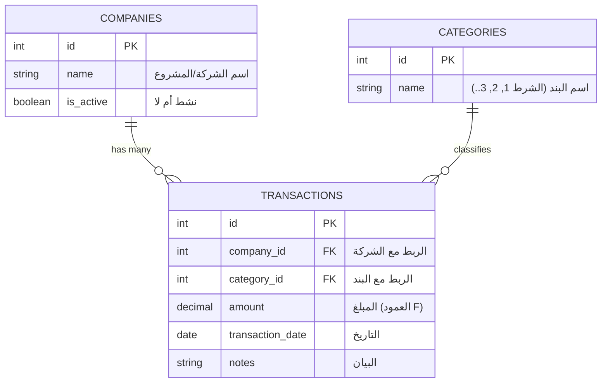

# وحدة التقارير المالية المجمعة متعددة الكيانات (Multi-Entity Financial Consolidation)

> [!NOTE]
> هذا الوصف مصمم ليكون جاهزاً للنسخ واللصق في مستندات متطلبات النظام (PRD) أو لتقديمه للمبرمجين كـ "ميزة" (Feature) يتم دمجها في أي نظام تخطيط موارد (ERP) أو نظام محاسبي.

## 📌 نبذة عن الميزة (Feature Overview)
نظام فرعي متكامل لإدارة الحركات المالية، يهدف إلى تجميع وتحليل الأرباح، الإيرادات، والمصروفات لعدة شركات أو مشاريع (أو مراكز تكلفة) تابعة لجهة قابضة واحدة. تقدم هذه الميزة **خلاصة نهائية ديناميكية** تُحسب وتُحدّث تلقائياً (Real-time) بمجرد إدخال البيانات، دون الحاجة لأي تدخل برمجي أو تعديل يدوي عند توسع الأعمال.

## 🎯 المشكلة التي تعالجها
الأنظمة التقليدية والاعتماد على الجداول الإلكترونية (مثل الإكسل) تعاني من مشاكل جوهرية عند التوسع:
1. **صعوبة التوسع (Scalability):** إضافة مشروع جديد يتطلب إضافة أوراق عمل وتعديل معادلات معقدة يدوياً.
2. **الأخطاء البشرية (Human Errors):** احتمالية عالية لوقوع أخطاء أثناء نسخ ولصق المعادلات (كما حدث في إزاحة الأعمدة).
3. **غياب المركزية:** تشتت البيانات وضعف القدرة على بناء رسوم بيانية (Dashboards) تفاعلية.

تحل هذه الميزة تلك المشاكل بجعل "الشركات" عبارة عن بيانات مدخلة (Data) وليست هياكل صلبة (Hardcoded structures).

## ✨ الوظائف الأساسية (Key Features)

### 1. الإدارة الديناميكية للكيانات (Dynamic Entities Management)
- إمكانية إضافة أو تعديل أو إيقاف شركة/مشروع بضغطة زر (شاشة إدارة الشركات).
- تدرج الشركة المضافة فوراً في كافة القوائم المنسدلة للتقارير الختامية.

### 2. التوجيه المحاسبي الموحد (Standardized Categorization)
- ربط كل حركة مالية بـ (رقم البند) الموحد على مستوى المجموعة. (مثال: البند 1 يمثل نوعاً معيناً من الإيرادات أو المصروفات لكل الشركات).
- يضمن هذا التوحيد إمكانية المقارنة العادلة بين أداء الشركات المختلفة في الخلاصة النهائية.

### 3. تقرير "الخلاصة النهائية" الآلي (Automated Matrix Report)
- واجهة (Grid / Matrix) تفاعلية تضع أسماء الشركات كـ "صفوف"، وأرقام/أسماء البنود المالية كـ "أعمدة".
- يُحسب الإجمالي أفقياً (إجمالي أداء الشركة) ورأسياً (إجمالي أداء المجموعة لكل بند).
- إمكانية فلترة الخلاصة (حسب السنة، أو الربع، أو الشهر).

### 4. إمكانيات التصدير السريع
- تصدير الخلاصة بضغطة زر لملفات (Excel, PDF) للطباعة أو مشاركتها مع مجلس الإدارة.

---

## 🛠️ الهيكلة التقنية المقترحة للمطورين (Technical Blueprint)

> [!TIP]
> يمكنك إعطاء هذا الجزء للمبرمج ليفهم بالضبط كيف يصمم قاعدة البيانات الخاصة بهذه الميزة لضمان المرونة.

يجب التخلي عن فكرة "جدول لكل شركة"، واستخدام نموذج قاعدة البيانات العلائقية (Relational Model):

### كيف يتم توليد تقرير الخلاصة النهائية برمجياً؟
بدلاً من معادلات `SUMIFS` المعقدة، سيستخدم النظام استعلام قواعد بيانات تجميعي بسيط وسريع جداً:
* يقوم الاستعلام بتجميع (`SUM`) المبالغ (`amount`).
* مع تجميعها باستخدام (`GROUP BY`) الـ `company_id` و الـ `category_id`.
* بناء مصفوفة (Pivot) في واجهة المستخدم (Front-end) لعرض البيانات تماماً كشكل "الخلاصة النهائية" في الإكسل، مهما زاد عدد الشركات!
